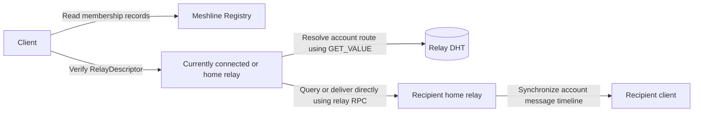

# Meshline Protocol 1.0

Status: Specification draft

Meshline is a communication system that uses blockchain addresses as long-term identities, devices for everyday use, and public relays for discovery, store-and-forward delivery, and optional channel and group hosting. This specification defines the network interoperability rules between clients, account devices, and public relays.

## Overall interaction

## Protocol boundaries and dependencies

| Document | Contents | Consumers and outcomes |
|---|---|---|
| [General conventions](general.md) | Defines the common scope, normative terminology, network context, data representations, and cryptographic conventions | All implementations follow the same foundational rules and use the same protocol inputs |
| [Relay Registry](registry/README.md) | Defines the records, public ABI, and observable behavior of the on-chain public-relay membership directory | Clients and relays obtain candidate relays' identities, HTTPS endpoints, and membership status |
| [Client–relay protocol](client-relay/README.md) | Defines the `/meshline/v1` HTTP/WSS interfaces, device sessions, account and device state, profiles, account route access, contacts, messaging, and channel and group hosting | Clients call their home relay, currently connected relay, or designated hosting relay |
| [Relay DHT protocol](relay-dht/README.md) | Defines the relay overlay, connection authentication, and distributed publication, replication, lookup, and candidate selection of account routes | Public relays maintain the account-to-home-relay mapping over `/meshline/kad/1.0.0` |
| [Relay RPC protocol](relay-rpc/README.md) | Defines direct account queries and cross-relay delivery of end-to-end ciphertext | Verified public relays communicate directly over `/meshline/relay/1.0.0` |
| [Normative test vectors](test-vectors/README.md) | Provides fixed inputs, protocol bytes, and expected results | Implementers run deterministic interoperability tests for encoding, signatures, derivation, and encryption |

Clients do not act as DHT nodes. Messages are not forwarded hop by hop along a DHT lookup path; after resolving the recipient's account route, the source relay connects directly to the recipient's relay. The Registry handles public-relay membership only and does not store user identities, contacts, account routes, or messages.
