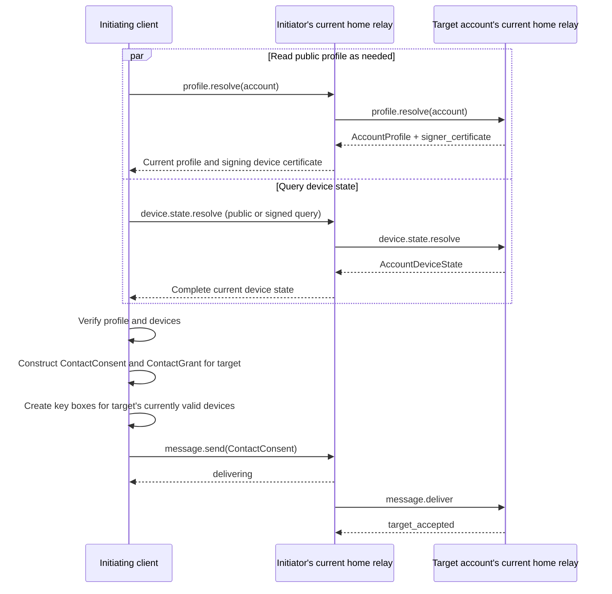
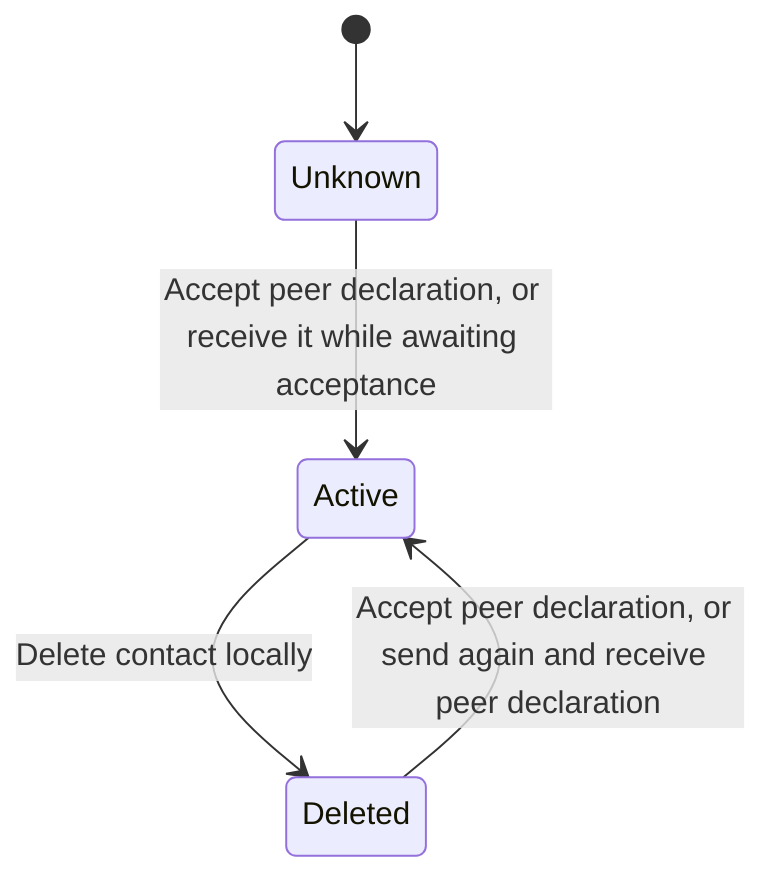

# Contacts and Authorization

[Client–relay protocol](../README.md)

## Contact Bootstrapping

The protocol supports two sources for contact bootstrapping:

1. `ContactInvite`: use its `inviter` as the target account and place the invitation in `authorization` of a signed [`device.state.resolve`](../methods/device-state.md#devicestateresolve) query. The destination relay verifies it and returns the complete `AccountDeviceState`.
2. Exact account ID: make a public `device.state.resolve` call by account ID. The destination returns device state only when the target's current profile enables public discovery.

Read the target profile through [`profile.resolve`](../methods/profiles.md#profileresolve). Successful profile retrieval grants neither device-query nor message-delivery permission.

This protocol does not infer target accounts from display names, profile text, or similar account IDs.

### `ContactInvite`

`ContactInvite` is a compact invitation credential an account generates and shares with potential contacts through links, QR codes, or other out-of-band channels. The recipient uses an invitation-authorized signed `device.state.resolve` query to obtain device state from the target's current home relay, then encrypts the first contact request for its currently valid devices.

| Field | Type | Required | Semantics and constraints |
|---|---|---|---|
| `$type` | string | Yes | Fixed as `meshline.contact.invite` |
| `inviter` | string | Yes | Inviting [account ID](../core-objects/accounts-and-devices.md#account-id) |
| `signer_device_id` | string | Yes | [Device ID](../core-objects/accounts-and-devices.md#device-id) derived from the signing device's `DeviceCertificate` |
| `expires_at` | integer | Yes | Expiry time; MUST be later than the current time at verification |
| `device_signature` | string | Yes | 64-byte Ed25519 signature by the device identified by `signer_device_id` over this `ContactInvite` excluding this field, unpadded base64url |

Signing input follows [Network-bound JSON inputs](../../general.md#network-bound-json-inputs). Recipients can check encoding, inviter account, signing device, and validity period offline, but can locate the currently valid device matching `signer_device_id` and verify the invitation signature only after obtaining the target account's current, validly signed `AccountDeviceState`. Removal or invalidation of the signing device invalidates the invitation. Adding or removing other devices or renewing their certificates does not change its body.

`ContactInvite` defines no usage count. Different accounts may use the same invitation to initiate contact requests before expiry. Relays and clients MUST NOT mark it used or invalidate it because any request succeeds. Every bootstrap delivery still must pass relay envelope, authorization, and resource-limit checks; an individual delivery result does not change the invitation's validity.

### Bootstrapping and the First Contact Request

#### Client Preparation and Delivery

Both bootstrapping sources use the same device retrieval and delivery flow. A client MUST find at least one currently valid receiving device in verified device state before constructing and sending a contact request. It MUST NOT send if the device array is empty or every device is invalid:

Standard clients should select all currently valid devices from the complete state returned by `device.state.resolve` and create key boxes for them, so every current device can receive the contact request; the protocol permits selecting a subset. Device validity at delivery and message visibility follow [Receiving validation rules](message-delivery.md#receiving-validation-rules) and [Device visibility](message-timeline.md#device-visibility). If delivery fails because all target devices are unavailable, the sender MUST call `device.state.resolve` again and resend under the `device_unknown` rule in [Delivery deadlines and retries](message-delivery.md#delivery-deadlines-and-retries).

#### Destination Relay Bootstrap Validation

Before accepting public bootstrap delivery without `ContactInvite`, the target account's current home relay MUST confirm:

1. The current valid route designates this relay as the target's home relay, and a current profile exists with public discovery enabled.
2. The `message.deliver` parameters include the envelope signer's `signer_certificate` and omit `authorization`.

Invitation bootstrap delivery MUST carry a valid `ContactInvite` issued by the target account in `authorization`. The destination checks the target account against the invitation supplied with this delivery, locates its currently valid signing device in current device state, and verifies its signature and validity period. A not-yet-accepted delivery with an invalid invitation MUST be rejected; earlier device-query authorization cannot be reused. Already accepted requests continue under [Idempotent message retries](message-delivery.md#idempotent-message-retries).

## Establishing a Contact Relationship

After decrypting public or invitation bootstrap delivery, a receiving device may process the relationship under the following flow only if it obtains a valid `ContactConsent`. It MUST confirm that the declaration actually comes from the sender account and device named in the outer envelope, and that its contact grant is signed by a valid device of that account and grants access to the target account. Other business objects MUST NOT gain state-change authority merely by arriving through bootstrap delivery.

### `ContactConsent`

`ContactConsent` expresses the sender's agreement to establish a contact relationship with the target. After verifying and saving its [`ContactGrant`](#contactgrant), the recipient may access the sender's account within that grant's permissions. Whether a local relationship is established follows [Contact state transitions](#contact-state-transitions).

| Field | Type | Required | Semantics and constraints |
|---|---|---|---|
| `$type` | string | Yes | Fixed as `meshline.contact.consent` |
| `device_state` | AccountDeviceState | Yes | Sender's complete account device state when sending this declaration; the account signature MUST be valid, and currently valid devices MUST include the device signing the outer envelope |
| `grant` | ContactGrant | Yes | Sender's grant to the target; the protected account MUST be the sender account, the authorized contact account MUST be the outer envelope's target, and `signatures` MUST include a valid signature keyed by the envelope signer's device ID |
| `note` | string | No | Accompanying note; if present, MUST contain at least one non-[whitespace character](../../general.md#text-whitespace-characters); at most 1 KiB (1,024 UTF-8 bytes) |

Recipients MUST verify the separate signatures and field bindings of `device_state` and `grant` under the table. Device state MUST belong to the outer envelope's sender account; grant signatures can be verified only with currently valid devices in that state. If the recipient already stores device state for the same account, it MUST reject an older `revision`, or an equal revision with different complete state content. Content comparison follows [`device.state.publish`](../methods/device-state.md#devicestatepublish).

### Contact State Transitions

Contact state transitions involve incoming pending requests, outgoing awaiting-acceptance state, and established relationships. The first two are identified by the other account and do not mean a relationship already exists.

1. When the user initiates adding a contact, the client sends its own `ContactConsent` and saves awaiting-acceptance state for that account. No relationship is established until a valid declaration arrives from the other party.
2. If no local relationship exists when valid `ContactConsent` arrives, and the client is still awaiting that account's acceptance, it saves the incoming grant and establishes the relationship. Otherwise it saves the declaration as a pending request for the user to decide, without automatically establishing or restoring a relationship.
3. When the user accepts a pending request, the client saves the other party's grant, sends its own `ContactConsent`, and establishes the local relationship. The return declaration uses the `ContactGrant` from the other party to this account as delivery authorization.
4. Once established, clear pending requests and awaiting-acceptance state for that account. A further valid declaration from an existing contact updates its incoming grant under [`ContactGrant`](#contactgrant), without creating another pending request or automatically sending a declaration back. Similarly, no return declaration is needed when receipt while awaiting acceptance completes establishment.

If both parties initiate declarations simultaneously, each may establish the relationship after verifying the other's declaration. Without a local relationship or awaiting-acceptance state, a late declaration can only become a pending request; it cannot automatically restore a deleted relationship.

Relationships follow these transitions. Sending a declaration or receiving one still awaiting user action does not itself change relationship state:

A contact deletion record (tombstone) prevents restoration of old state; it does not block that account. Pending contact requests may still be displayed and accepted while a tombstone exists, but it MUST be retained until both parties agree to establish a relationship.

Contact state exists only locally at endpoints and in end-to-end encrypted messages. Relays MUST NOT turn it into a public user directory.

## Contact Grants

Each party gives the other its own [`ContactGrant`](#contactgrant) through `ContactConsent`. Even while a request is pending, the recipient may use the valid received grant to query the other account's current devices, and uses it to deliver its own consent when accepting. After establishment, each party stores both the incoming grant issued by the other account and the outgoing grant issued by its own account.

### `ContactGrant`

`ContactGrant` is a persistent communication credential jointly maintained by an account's devices and granted to a contact account. A valid grant permits `grantee` to query `grantor`'s current devices and send it messages. The body consists of both accounts and an optional expiry; `signatures` stores each authorizing device's independent signature over that same body.

| Field | Type | Required | Semantics and constraints |
|---|---|---|---|
| `$type` | string | Yes | Fixed as `meshline.contact.grant` |
| `grantor` | string | Yes | [Account ID](../core-objects/accounts-and-devices.md#account-id) issuing and protected by this grant |
| `grantee` | string | Yes | Authorized contact's [account ID](../core-objects/accounts-and-devices.md#account-id) |
| `expires_at` | integer | No | Expiry in Unix seconds; the grant becomes invalid at this time. Omission means no scheduled expiry and ranks above any finite period in grant selection |
| `signatures` | object&lt;string, string&gt; | Yes | Nonempty device-signature map; keys are canonical [device IDs](../core-objects/accounts-and-devices.md#device-id), and values are those devices' 64-byte Ed25519 signatures over the grant body, unpadded base64url |

Every `signatures` entry MUST meet key and value format requirements; entry objects and additional metadata are forbidden. Duplicate JSON keys MUST be rejected before map construction under [JSON and field representation](../../general.md#json-and-field-representations), without first-value or last-value overwriting. Key order has no business semantics.

#### Grant Signatures

Each device independently signs the body with its device signing key, without needing the account private key. Signing uses the enclosing `ContactGrant`'s [network-bound JSON input](../../general.md#network-bound-json-inputs):

1. Copy the complete `ContactGrant`, remove root `signatures`, and retain `$type` and all other known and unknown fields.
2. Produce Canonical JSON UTF-8 bytes using the trusted network context as the signing input.
3. Directly sign these bytes with the device's Ed25519 private key in pure Ed25519 mode under RFC 8032. Encode the 64-byte signature as unpadded base64url and store it in `signatures` under that device ID.

All devices sign the same body. Adding, merging, or removing device signatures or changing map-key order does not affect verification of retained signatures. Changing any body field, field presence, or network context requires re-signing.

Verifiers MUST locate the device certificate by the map-key device ID in `grantor`'s currently valid `AccountDeviceState`, check its account, device-ID derivation, dual signatures, and validity period, then use its `signing_public_key` to verify the input above. Unknown grant fields or self-declared public keys MUST NOT substitute for these checks. A nonexistent device ID, invalid certificate, or certificate not belonging to `grantor` makes that signature invalid.

#### Grant Validity

A valid grant MUST have at least one mapped device in `grantor`'s currently valid device set whose signature verifies. Once removed from account state or once its certificate expires, that device ID's signature immediately loses current authorization effect; other valid signatures from current devices may keep the grant valid. Well-formed entries with failed signatures or no-longer-valid devices grant no authority and cannot replace the requirement for at least one currently valid device signature.

For access authorized by `ContactGrant`, the target's current home relay MUST verify the grant and confirm that the target has granted the requested access to the requesting account. Failure rejects this read or delivery.

#### Grant Selection and Maintenance

Comparison scope is determined solely by the trusted network context and directed account pair `(grantor, grantee)`. Reversing accounts gives a different scope; unknown properties do not determine scope. A new grant MUST pass object, account-binding, expiry, and currently valid device signature checks before updating local authorization. An invalid grant cannot participate in selection merely by declaring a longer validity period. If no grant for the scope is saved, a verified new one may be saved; otherwise:

- For identical complete bodies after excluding `signatures`, merge valid signatures by device ID. Body comparison includes `expires_at` and all unknown properties. Adopt a new valid signature if the local grant lacks a valid signature for that device. Invalid signatures MUST NOT overwrite valid ones or be treated as valid merely because the device ID matches.
- For different complete bodies, replace the entire old body and signatures only if the new grant's `expires_at` is greater.
- For different bodies with a smaller or equal new `expires_at`, discard the new grant without reporting a body conflict, changing the saved grant, or merging signatures. Two omitted `expires_at` fields are equal periods.

Omitted `expires_at` is indefinite and may replace a finite grant; a finite grant cannot replace an indefinite one. This supports extending validity, not shortening or revoking an existing grant. Every use still requires current-validity checks; choosing a longer period does not restore invalid signatures.

A device may add a signature to an identical body or create a longer-lived grant. A new grant MUST re-sign the entire new body, including unknown properties. Changing expiry changes the signing input, so old signatures cannot be reused. Selection and merging occur in local grant state.

When maintaining local grants or constructing new copies, signatures from devices no longer currently valid may be removed based on verified current [`AccountDeviceState`](../core-objects/accounts-and-devices.md#accountdevicestate). The cleaned grant MUST still contain at least one currently valid device signature. Its body and retained signature bytes MUST remain unchanged.

None of this selection, merging, or signature cleanup may rewrite an existing outer signed object containing the grant.

## Contact Synchronization Within an Account

Contact state synchronizes among the account's devices through [`AccountContactSync`](#accountcontactsync). Submission follows [Account self-delivery rules](message-delivery.md#delivery-flow); reads and certificate validation follow [`message.timeline.sync`](../methods/messaging.md#messagetimelinesync). For business-object and sending-device requirements, see [Business objects inside envelopes](../core-objects/messages-and-content.md#business-objects-inside-envelopes).

### `AccountContactSync`

`AccountContactSync` is a batch object for exchanging contact state among account devices. It may contain a complete snapshot or records since the last synchronization; recipients merge entries individually.

| Field | Type | Required | Semantics and constraints |
|---|---|---|---|
| `$type` | string | Yes | Fixed as `meshline.account.contacts.sync` |
| `records` | array&lt;ContactRecord&gt; | No | Contact records to merge; may be omitted or empty if none; `account` values MUST be distinct |
| `request_snapshot` | boolean | No | Defaults to `false`; only explicit `true` requires the recipient to return a contact snapshot. Responses omit it or set it to `false` to prevent request loops |

After validating and accepting records, the recipient should add its signature to each `grant_to_contact` lacking it and synchronize the update under [Contact grant updates and synchronization](#contact-grant-updates-and-synchronization).

### `ContactRecord`

`ContactRecord` is one account's contact state synchronized among its own devices. It may carry `grant_from_contact`, issued by the contact to this account, and `grant_to_contact`, issued in the opposite direction. The former is used to communicate with the contact; the latter lets other local-account devices add signatures and send the updated grant to the contact. This object is transmitted only as a `records` element of [`AccountContactSync`](#accountcontactsync) inside same-account end-to-end encrypted messages.

| Field | Type | Required | Semantics and constraints |
|---|---|---|---|
| `account` | string | Yes | Contact's [account ID](../core-objects/accounts-and-devices.md#account-id); MUST NOT be the account represented by this internal synchronization |
| `alias` | string | No | Local display name; if nonempty, MUST NOT consist solely of [whitespace characters](../../general.md#text-whitespace-characters); at most 256 UTF-8 bytes |
| `status` | string | Yes | Saved relationship state: `active` retains the contact; `deleted` means deleted |
| `grant_from_contact` | ContactGrant | No | Grant from `account` to this account; permitted for a retained relationship; `grantor` MUST equal `account`, and `grantee` MUST be this account |
| `grant_to_contact` | ContactGrant | No | Grant from this account to `account`; permitted for a retained relationship; `grantor` MUST be this account, and `grantee` MUST equal `account` |
| `updated_at` | integer | Yes | UTC Unix seconds of this contact-state change; unchanged when forwarding existing state |

#### Validation and Revision Selection

Recipients MUST verify the outer envelope signature, confirm both sending and receiving accounts are their own, and confirm the sender is a currently valid device of that account. Grants in records still follow [`ContactGrant`](#contactgrant) validation. Deleted-contact records MUST NOT carry grants.

Within one account's synchronized state, a valid record with greater `updated_at` replaces a lower one for the same `account`. For two valid records with equal `updated_at`, the recipient retains the later-received record. A batch MUST NOT contain duplicate `account` values, so this rule applies only to different deliveries or local updates processed in sequence.

This rule does not attempt deterministic convergence of concurrent updates across all devices. Devices may receive the same equal-time records in different orders and temporarily reach different results. A later update resolving such differences MUST use a strictly greater `updated_at`.

#### Contact Deletion and Reestablishment

Tombstones participate in state selection among the account's devices, keeping older retained-relationship records invalid. `ContactConsent` awaiting user action does not establish a relationship and MUST NOT clear a tombstone or be encoded as an active `ContactRecord`. To reestablish a relationship, a current device creates a new retained-relationship record later than the selected tombstone under the selection rules.

Locally deleting a contact or adopting its deletion record through account synchronization MUST clear awaiting-acceptance state for that account. Merely having sent it `ContactConsent` in the past is not grounds for automatic restoration on receipt of its declaration.

#### Grant Merging and Synchronization

Unselected old records do not update local contact state or grants. When adopting an active record, compare `grant_from_contact` and `grant_to_contact` separately with locally stored grants in the same direction under [`ContactGrant`](#contactgrant).

Omission of a direction's grant does not clear its local grant. Discarding a new grant under validity-period rules or retaining an existing valid signature during merging does not prevent adoption of other valid fields in the record.

Adopting a deletion record still clears grants in the relationship. Expiry comparison MUST NOT prevent deletion, or let old records excluded by the tombstone or standalone grant messages restore the relationship. Reestablishment still follows [Contact state transitions](#contact-state-transitions).

Recipients may merge signatures over identical bodies, adopt renewed grants, or remove invalid-device signatures under `ContactGrant` rules. To synchronize these local results onward, the current device MUST create a new `ContactRecord` with `updated_at` strictly greater than the selected record and write the selected grants into it. It cannot rewrite an existing outer envelope and forward it as the original message.

## Contact Grant Updates and Synchronization

### Grant Update Messages

A renewed or signature-updated `ContactGrant` is sent directly as an encrypted business object to an established contact, without an extra wrapper. The protected account MUST be the outer envelope's sender; the authorized contact MUST be its target. This message does not create a relationship; it only updates the recipient's stored grant from the sender to the recipient. The recipient MUST update local authorization under [`ContactGrant`](#contactgrant) validation, selection, and signature-maintenance rules.

When sending this `ContactGrant`, `authorization` carries a valid grant from the contact to the sender. The grant in the body goes from sender to recipient, while the outer authorization goes from recipient to sender; their directions are opposite. The new body grant cannot replace the valid outer authorization needed for delivery. A recipient wishing to synchronize to its own other devices creates a new contact record with greater `updated_at`.

### Additional Device Signatures and Synchronization

After receiving `AccountContactSync`, the client validates and selects each record under [`ContactRecord`](#contactrecord). After adding its device signature to `grant_to_contact`, it MUST:

1. Save the merged grant.
2. Create a new ContactRecord containing it, with `updated_at` strictly greater than the currently selected record.
3. Send a synchronization batch containing the new record to the account's other current devices.
4. Use the contact's incoming grant to send the updated outgoing grant to that contact.
5. In planned rotation, refrain from revoking the last old signing device until the contact confirms receipt or the relay accepts responsibility for reliable delivery of the update.
