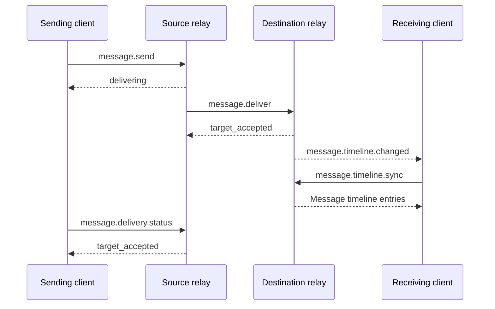

# Message Delivery

[Client–relay protocol](../README.md) · [Message methods](../methods/messaging.md) · [Cross-relay delivery method](../../relay-rpc/methods/message-delivery.md#messagedeliver)

Messages are delivered at account granularity. The sending client submits an immutable `MessageEnvelope` and key boxes for devices of the sender and recipient accounts to decrypt it. The source relay is the sender account's home relay that accepts `message.send`; the destination relay serves the recipient account. They may be the same relay.

## Delivery Flow

### Cross-Account Delivery

When sending to another account:

1. The client calls `message.send` on the source relay. The source validates the request under that method and assumes responsibility for further delivery after acceptance. If `sender_boxes` is supplied, it appends the original envelope and those boxes to the sender account's timeline; otherwise no sent record enters the timeline.
2. The source delivers according to the recipient account's current route. If this relay also serves the recipient, it handles delivery directly; otherwise it calls `message.deliver` on the destination relay with the original envelope, `recipient_boxes`, sending device certificate, and original authorization material. Sender key boxes remain at the source relay.
3. The destination verifies receiving conditions under [Receiving validation rules](#receiving-validation-rules). After acceptance, it appends the original envelope and `recipient_boxes` to the recipient account's timeline for authorized devices to synchronize. Once the source confirms destination acceptance, delivery status becomes `target_accepted`.

`message.send` returns the status known by the source relay at that moment: `delivering` if unfinished, or a terminal state if finished. Subsequent queries use `message.delivery.status`. Local delivery may also return `delivering` before receiving-side acceptance. The source's responsibility continues until a terminal state or delivery deadline and survives relay restarts. Delivery failure after acceptance does not remove the sent record.

The sent record's `accepted_at` is the source relay's acceptance time; the received record's `accepted_at` is the destination's. Each record's retention period and device visibility are determined at acceptance; see [Account message timeline](message-timeline.md#account-message-timeline).

#### Delivery Example

### Account Self-Delivery

For account self-delivery, the sender and recipient accounts in `MessageEnvelope` MUST be identical. The client submits only to that account's current home relay, which MUST NOT initiate or accept inter-relay `message.deliver` for this delivery.

The relay validates the request under [Receiving validation rules](#receiving-validation-rules) and determines which devices may synchronize under [Device visibility](message-timeline.md#device-visibility). On success, it appends only one record to the account's timeline, storing the original envelope and complete `recipient_boxes`, and directly returns `target_accepted`.

### Receiving Validation Rules

Before accepting a message, the destination relay MUST confirm:

1. It is the home relay designated by the recipient account's currently valid route.
2. The original envelope and recipient key boxes meet the [object constraints](../core-objects/messages-and-content.md#messageenvelope); the sending device certificate passes the signature and identity-binding checks in [`DeviceCertificate`](../core-objects/accounts-and-devices.md#devicecertificate); the envelope's device signature is valid; and the certificate matches its `from` and `from_device_id`. The source relay confirms the sending device's permissions at submission through the device session.
3. The envelope's `created_at` meets the destination relay's own clock tolerance and message delivery age limit. Source and destination policies are independent.
4. Non-self-delivery has valid account access authorization: a [`ContactGrant`](contacts.md#contactgrant) from the recipient account to the sender account, or a [`ContactInvite`](contacts.md#contactinvite) issued by the recipient account. If credentials are omitted, the recipient account MUST allow public discovery. Invalid credentials MUST NOT fall back to public bootstrapping. Authorization grants only ciphertext delivery permission; it does not establish validity of the enclosed business object.
5. At least one device in the recipient key boxes is valid in the recipient account's current authoritative device state. Some unavailable devices do not prevent acceptance of the entire message; unavailable devices cannot read its record. Boxes need not cover all current devices.

If the envelope, signature, or authorization is invalid, or every recipient device is unavailable, reject receipt and append no received record. Previously accepted requests within result retention follow [Idempotent message retries](#idempotent-message-retries).

## `DeliveryStatus`

Successful responses from `message.send`, `message.deliver`, and `message.delivery.status` use this object to express delivery status for the entire message.

| Field | Type | Required | Semantics and constraints |
|---|---|---|---|
| `status` | string | Yes | Delivery status defined below |
| `error` | [RelayError](../methods/conventions.md#relayerror) | Conditional | Delivery failure reason; MUST be present when `status` is `failed` and omitted otherwise |
| `accepted_at` | integer | Yes | Unix seconds when the relay accepted the message; `message.send` and `message.delivery.status` use the source relay's time, and `message.deliver` uses the destination relay's time |

### Status Values and Terminal-State Rules

| status | Meaning |
|---|---|
| `delivering` | The source relay has accepted the message; delivery has not finished |
| `target_accepted` | Successful terminal state: the destination relay has accepted the message and at least one recipient device may read it |
| `failed` | Failed terminal state: the source relay has ended delivery, with the reason in `error` |

`target_accepted` means the destination relay accepted the message, not that a receiving client has synchronized, decrypted, or displayed it. Later device permission changes or body expiry do not change this status.

The source stays in `delivering` while retrying, refreshing routes, or confirming results. Once `target_accepted` or `failed` is reached, the terminal state and failure reason remain unchanged during result retention; late responses do not alter them. `error` uses the failure reason determined by [Delivery deadlines and retries](#delivery-deadlines-and-retries).

## Idempotent Message Retries

### Duplicate Detection and Retry Rules

Within the same network and relay, `message.send` and `message.deliver` each use `(from, message_id)` as their logical message key. Transport correlation IDs, connections, and sessions for HTTP, WebSocket, and relay RPC do not participate in logical keys or request-content comparison.

Request content is identical only when the [Canonical JSON](../../general.md#canonical-json) of the complete request parameter object is identical, including signatures, unknown fields, array order, and optional-field presence. HTTP uses its request body; WebSocket and relay RPC use `params`.

Requests still must pass basic parameter validation and the corresponding session or relay-connection authentication and meet the method's invocation requirements. During result retention:

- The same key with identical content returns the latest delivery status known by this relay, with unchanged `accepted_at`. Duplicate requests MUST NOT add timeline records, sequences, delivery tasks, or timeline-change notifications, modify the original record's key boxes or device visibility, or restart finished delivery.
- The same key with different content returns `state_conflict` and MUST NOT overwrite the original request content or result.
- Concurrent requests, lost responses, and relay restarts do not alter these requirements. Expiry of the delivery age limit, business authorization invalidation, or device-state changes do not retroactively negate acceptance. Messages not yet accepted on the receiving side still must meet receiving conditions.

An explicit rejection before acceptance creates no acceptance result. The caller may correct and resubmit the request; for `device_unknown`, it must refresh devices and regenerate the envelope, key boxes, and message ID.

A timeout, disconnection, or lost response does not prove rejection. A retry MUST submit the unchanged request to the same relay.

### Delivery Result Retention Rules

Each relay's result retention lasts at least until its `accepted_at` plus the `message_retention` at acceptance. During source retention, `message.delivery.status` MUST provide the corresponding `message.send` result, including self-delivery. Later configuration changes MUST NOT shorten an already promised retention period; repeated requests do not extend it.

After retention ends, the protocol no longer guarantees historical result availability or request idempotency. A relay returning an existing result must still follow the rules above. If it cannot recognize the original request, it handles it as not yet accepted; requests beyond the current delivery age limit return `message_expired`. It may also return `message_expired` if it can determine that retention has ended and the result is unavailable.

## Delivery Deadlines and Retries

### Delivery Deadline

The delivery deadline is fixed when the source accepts a message and never changes thereafter. It is the earlier of:

- Envelope creation time plus the source's message delivery age limit at acceptance.
- Source acceptance time plus its `message_retention` at acceptance.

### Error Handling and Retries

Before the deadline, the source handles delivery errors as follows. Automatic retries use a local backoff policy and MUST NOT form an immediate request loop. Retries retain the original envelope, recipient key boxes, sending device certificate, and authorization material unchanged.

When `rate_limited` carries valid `data.retry_after`, the source MUST also observe the minimum wait in [Rate-limit retry waiting rules](../methods/conventions.md#rate-limit-retry-waiting-rules); absent a hint, it uses local backoff. Waiting does not change the fixed deadline. If still unfinished at the deadline, end delivery under the table below; do not extend delivery responsibility or retry after the deadline to satisfy a waiting hint.

| Condition | Handling |
|---|---|
| `internal_error`, `bad_gateway`, `rate_limited`, `temporarily_unavailable` | Retry, retaining `delivering` |
| `route_stale`, `target_not_local`, `route_not_found`, `not_found`, `invalid_state` | Refresh the route bypassing caches and retry; switching targets must meet the next section's rules |
| `device_unknown` | End delivery with this error; the client refreshes devices and sends again with a new envelope, key boxes, and message ID |
| `clock_skew` | End delivery with this error; retain the original envelope and sent record without automatically rewriting `created_at`, re-signing, or resending |
| Other defined errors | End delivery with that error |
| Unrecognized remote error code | End delivery with `error.code` set to `bad_gateway` |
| Deadline reached before completion | End delivery with `error.code` set to `message_expired` |

### Delivery Result Confirmation and Destination Relay Switching

When a timeout, disconnection, or lost response leaves receipt unknown, the source confirms with the original target before the deadline; for cross-relay delivery, it retries `message.deliver` unchanged. It MUST NOT deliver an unknown-result message to another relay merely because the original target is temporarily unreachable.

Switching targets is permitted only if the original target explicitly rejects this receipt with a route error, or receipt is known not to have been attempted. The new target MUST be designated by a valid route with a higher `revision`.

The source's retry deadline may be later than the destination's result retention. Rejection after result expiry and timeout failure due to unconfirmed results do not prove that the destination never accepted the message. Neither the source nor the client may automatically resend with a new message ID solely on that basis.

For the effect of account migration on existing delivery, see [Home relay changes](account-and-device-lifecycle.md#message-delivery-and-result-queries).
