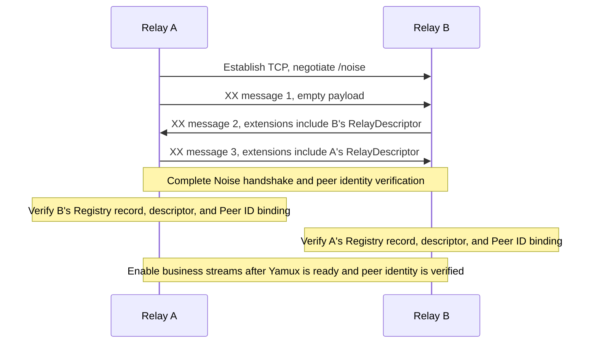

# Connections and identity authentication

[Relay DHT protocol](../README.md) · [Overlay and node maintenance](overlay-and-maintenance.md)

This chapter defines relay connections and identity authentication in the DHT overlay. Connections use TCP, Noise, and Yamux. The Noise handshake exchanges both parties' complete `RelayDescriptor` objects. Each party verifies its peer's relay identity using the current Registry record and the Peer ID verified by the handshake.

## Candidate discovery

When a relay discovers a target through the Registry but has no usable libp2p address, it obtains and verifies the `RelayDescriptor` from the Registry's HTTPS endpoint under [relay discovery](../../client-relay/concepts/discovery-and-sessions.md#relay-discovery). When a valid, verified descriptor is already available, it connects using the descriptor's libp2p TCP candidate addresses.

Candidates obtained from locally stored peer information or verified DHT peers may contain only a Peer ID and multiaddr. A relay MAY connect to the candidate's libp2p TCP address and perform the identity handshake in this chapter. The handshake-derived Peer ID MUST equal the Peer ID declared by both the candidate and the dial address. Until relay identity verification succeeds, the connection MUST NOT carry business streams or cause the candidate to enter the eligible-peer set or routing table.

Both candidate connections and inbound connections from unfamiliar relays obtain the peer's complete `RelayDescriptor` during the handshake and validate it as described below. A separate HTTPS descriptor fetch is not required to authenticate that connection.

## Relay connection and authentication flow

Here A initiates the TCP connection and B responds:

After completing the Noise handshake and verifying `identity_sig`, each party verifies its peer as follows:

1. Derive the connected peer's Peer ID from `identity_key`; if the target Peer ID is known, it MUST match. Parse `extensions.relay_descriptor` from the handshake. If the target `relay_id` is known, the descriptor's `relay_id` MUST match it.
2. In the locally trusted [network context](../../general.md#network-context), obtain the current [Registry record](../../registry/core-objects.md#relayentry) for the relay identified by the descriptor's `relay_id`.
3. Validate the handshake descriptor under the [descriptor verification rules](../../client-relay/core-objects/relay-descriptor.md#relay-descriptor-validation-rules).
4. Confirm that the Peer ID bound by the descriptor equals the Peer ID verified by this Noise handshake.

Before completing peer identity verification, a relay MUST NOT send or process business requests or notifications over the connection. If any identity check fails, it MUST close the connection and MUST NOT add the peer to the eligible-peer set or routing table.

Subsequent membership checks, descriptor validity, and Peer ID rebinding follow the [overlay maintenance rules](overlay-and-maintenance.md#joining-the-dht-and-maintaining-the-routing-table).

## Security protocol and handshake format

Secure-connection negotiation uses the standard libp2p protocol ID `/noise`, with Noise protocol name `Noise_XX_25519_ChaChaPoly_SHA256`. Key generation, peer identity authentication, handshake processing, and frame encoding follow [libp2p Noise](https://github.com/libp2p/specs/blob/master/noise/README.md); connection multiplexing follows [libp2p Yamux](https://github.com/libp2p/specs/blob/master/yamux/README.md).

### Handshake payload and descriptor extension

The payloads of XX handshake messages 2 and 3 retain the standard protobuf `NoiseHandshakePayload`, containing `identity_key` (field 1), `identity_sig` (field 2), and `extensions` (field 4). A relay MUST include the `relay_descriptor` defined here in `extensions` for relay identity authentication after the handshake completes.

The connection responder sends its complete payload in the second handshake message; the initiator sends its complete payload in the third. Both are inside Noise-encrypted handshake payloads.

The following field is added to `NoiseExtensions`; other fields follow the definitions of their respective libp2p extensions:

| Field | Number | Protobuf type | Required | Semantics and constraints |
|---|---|---|---|---|
| `relay_descriptor` | 1025 (experimental) | bytes | Yes | UTF-8 JSON bytes of this endpoint's complete signed [`RelayDescriptor`](../../client-relay/core-objects/relay-descriptor.md#relaydescriptor), including `relay_signature` and unknown fields covered by the signature |

This specification uses experimental extension number 1025, which is greater than 1024 and has not received a formal allocation. A formal number must be registered under the [libp2p Noise extension registration rules](https://github.com/libp2p/specs/blob/master/noise/README.md#noise-extensions) and updated in this specification.

### Parsing and size validation

Handshake payloads follow the [standard Protobuf parsing rules](https://protobuf.dev/programming-guides/encoding/#last-one-wins): singular bytes fields use the last value, and singular embedded messages merge. After parsing, `identity_key`, `identity_sig`, `extensions`, and `extensions.relay_descriptor` MUST all be present. Type errors or invalid encodings MUST terminate the connection. Identity-signature, descriptor, and Peer ID binding checks MUST use the same parsed result. Unknown protobuf fields are ignored under compatibility rules.

Descriptor JSON encoding, decoding, and canonicalization follow the [general conventions](../../general.md#json-and-field-representations); its `relay_id` MUST be a [canonical relay ID](../../registry/core-objects.md#relay-id).

A single Noise handshake message MUST NOT exceed 65,535 bytes. This length includes Noise public keys, the complete protobuf payload, and encryption/authentication overhead, but excludes the outer length prefix. Exceeding the limit MUST terminate the connection.
