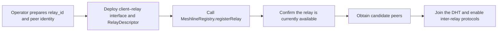

# Overlay and node maintenance

[Relay DHT protocol](../README.md) · [AccountRoute](../core-objects.md#accountroute)

## Overlay

DHT peers are operated by public relays with `active` Registry membership and a valid `RelayDescriptor`. Connections verify the complete handshake descriptor and its binding to the Peer ID under [relay connections and identity authentication](connection-and-authentication.md). Clients do not act as DHT nodes.

Eligible relays form a separate libp2p Kademlia DHT:

- Transport: TCP;
- Secure channel: [Noise](connection-and-authentication.md#security-protocol-and-handshake-format);
- Stream multiplexer: Yamux;
- Kademlia protocol ID: `/meshline/kad/1.0.0`;
- Key distance: under the libp2p Kademlia specification, apply SHA-256 separately to the raw lookup input and the Peer ID bytes, then compute the XOR distance between the two 32-byte results.

Peer IDs and multiaddrs MUST conform to the corresponding libp2p specifications. Kademlia behavior follows the [libp2p Kademlia DHT specification](https://github.com/libp2p/specs/blob/master/kad-dht/README.md), except where this protocol explicitly tightens or replaces it.

## Joining the DHT and maintaining the routing table

### Public-relay registration and joining flow

A relay may join the overlay only when its public service is available and its `RelayDescriptor` passes [relay descriptor verification](../../client-relay/core-objects/relay-descriptor.md#relay-descriptor-validation-rules).

### Joining at startup

At startup, a relay MUST:

1. Confirm from the Registry that its `status` is `active`;
2. Obtain initial candidates from the Registry or locally stored peer information, establish connections, and authenticate under [candidate discovery and connection authentication](connection-and-authentication.md#candidate-discovery);
3. Add verified candidates to the eligible-peer set;
4. Build a routing table through `/meshline/kad/1.0.0`.

### Runtime maintenance

During operation, a relay MUST refresh Registry state and refresh each relevant `RelayDescriptor` through that relay's HTTPS discovery endpoint. It MUST also maintain Kademlia buckets so that the routing table uses only currently eligible peers.

Candidates subsequently obtained through the DHT MUST likewise complete connection identity verification before entering the eligible-peer set and routing table.

If a relay discovers that a remote peer's membership has been disabled by its operator or suspended by Registry governance, its `RelayDescriptor` is no longer valid, or its Peer ID does not match, it MUST stop initiating new queries and deliveries to that peer and remove it from the eligible-peer set and routing table.

If a refreshed valid `RelayDescriptor` for the same `relay_id` binds a new Peer ID, the verifier MUST remove the old peer before adding the new one. It MUST NOT retain both at once.

When a single refresh result contains duplicate `relay_id` values, multiple Peer IDs for one `relay_id`, or multiple `relay_id` values for one Peer ID, the conflicting records MUST NOT be added separately to the routing table.

## Persistent node state

A DHT node SHOULD retain its peer private key and Peer ID across restarts. When changing peer identity, it MUST update its `RelayDescriptor` and rejoin under the [startup joining](#joining-at-startup) rules.

A DHT node MUST retain unexpired DHT values and their local expiry times across restarts. The routing table MAY be rebuilt. Expired values MUST NOT be returned as query results or used for routing or republication.

Account route version information MUST be persisted under the [route version and conflict-resolution](../core-objects.md#route-version-and-conflict-resolution) rules. The current home relay's route copies and its obligations to resume republication after restart are specified in [account route publication and resolution](account-route-lifecycle.md#republication-and-persistence).

## Peer and resource security

- The eligible-peer set and routing table MUST both preserve a one-to-one binding between `relay_id` and Peer ID; multiple candidate addresses MUST NOT count as multiple peers;
- When initiating connections, peers with different operator origins, IP subnets, and domain origins SHOULD be preferred;
- Registry membership verification, connection-level rate limits, and diversity of peer origins jointly constrain large sets of malicious peers.

A relay MAY disconnect or temporarily reject peers that continue to send invalid requests.

Implementations MAY use multiple independent query paths to reduce one malicious peer's ability to hide a route; path count and query concurrency are local policy. This protocol does not guarantee availability when a majority of eligible relays collude, the target relay refuses service, or the network is fully isolated.
