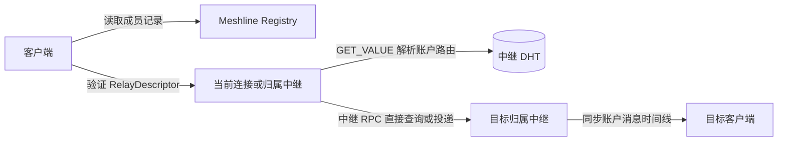

# Meshline Protocol 1.0

状态：规范草案

Meshline 是一个以区块链地址为长期身份、以设备为日常使用端、由公共中继提供发现、存储转发以及可选频道和群组托管服务的通信系统。本规范定义客户端、账户设备与公共中继之间的网络互操作规则。

## 总体交互

## 协议边界与依赖

| 文档入口 | 内容 | 使用者与结果 |
|---|---|---|
| [协议总则](general.md) | 定义全局适用范围、规范性用语、网络上下文、数据表示和密码学约定 | 所有协议实现共同遵循相同的基础规则和协议输入 |
| [中继注册表](registry/README.md) | 定义公共中继链上成员目录的记录、公开 ABI 和可观察行为 | 客户端和中继取得候选中继的身份、HTTPS 入口和成员状态 |
| [客户端—中继协议](client-relay/README.md) | 定义 `/meshline/v1` HTTP/WSS 接口、设备会话、账户与设备状态、资料、账户路由访问、联系人、消息收发、频道和群组托管 | 客户端调用归属中继、当前连接中继或指定托管中继 |
| [中继 DHT 协议](relay-dht/README.md) | 定义中继覆盖网络、连接认证，以及账户路由的分布式发布、复制、查询和候选记录选择 | 公共中继通过 `/meshline/kad/1.0.0` 维护账户到归属中继的映射 |
| [中继 RPC 协议](relay-rpc/README.md) | 定义直接账户查询和端到端密文的跨中继投递 | 已验证公共中继通过 `/meshline/relay/1.0.0` 直接通信 |
| [规范测试向量](test-vectors/README.md) | 提供固定输入、协议 bytes 与预期结果 | 实现者执行确定性编码、签名、派生和加密互操作测试 |

客户端不作为 DHT 节点。消息不沿 DHT 查询路径逐跳转发；源中继解析目标账户路由后，直接连接目标中继。Registry 只负责公共中继成员资格，不保存用户身份、联系人、账户路由或消息。
