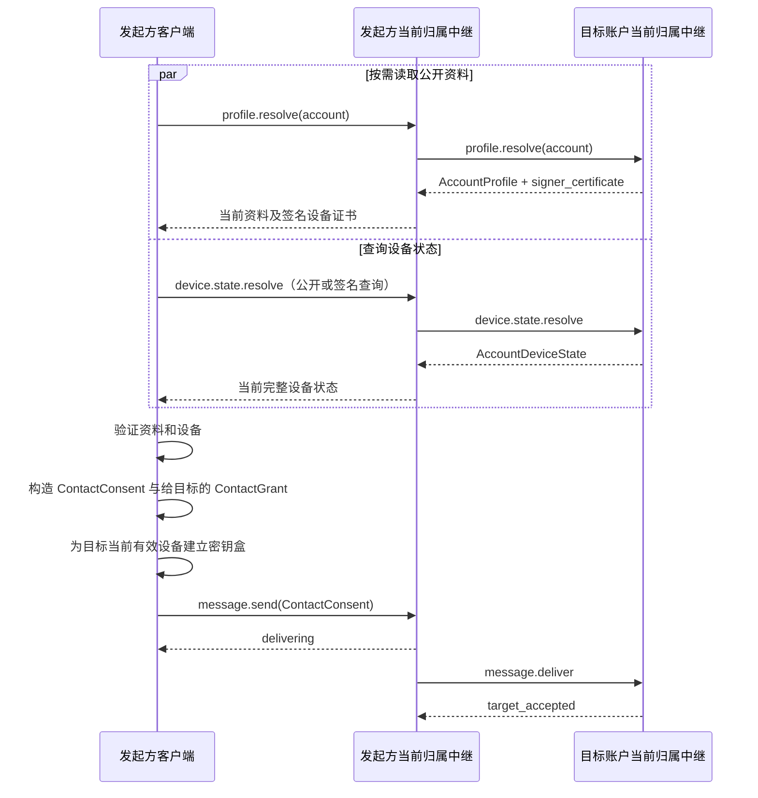
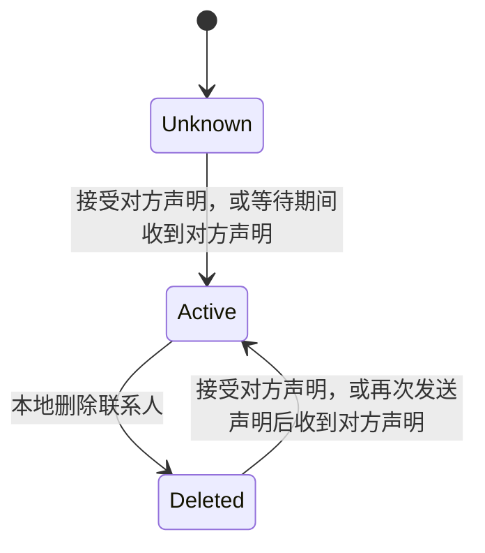

# 联系人与授权流程

[客户端—中继协议](../README.md)

## 联系人引导

协议支持两种联系人引导来源：

1. `ContactInvite`：以邀请的 `inviter` 为目标账户，把邀请放入 [`device.state.resolve`](../methods/device-state.md#devicestateresolve) 签名查询的 `authorization`；目标中继验证邀请后返回完整 `AccountDeviceState`；
2. 精确账户 ID：按账户 ID 公开调用 `device.state.resolve`；仅当目标账户当前资料已启用公开发现时，目标中继才返回设备状态。

目标账户资料通过 [`profile.resolve`](../methods/profiles.md#profileresolve) 读取。资料读取成功不授予设备查询或消息投递权限。

本协议不根据 display name、profile 文本或相似账户 ID 推断目标账户。

### `ContactInvite`

`ContactInvite` 是账户生成并通过链接、二维码或其他带外渠道交给潜在联系人的紧凑邀请凭据。接收方使用邀请授权的 `device.state.resolve` 签名查询，从目标账户的当前归属中继取得设备状态，再为其中的当前有效设备加密首条联系人请求。

| 字段 | 类型 | 必需 | 语义与约束 |
|---|---|---|---|
| `$type` | string | 是 | 固定为 `meshline.contact.invite` |
| `inviter` | string | 是 | 邀请发起账户的[账户 ID](../core-objects/accounts-and-devices.md#账户-id) |
| `signer_device_id` | string | 是 | 从签名设备的 `DeviceCertificate` 派生的[设备 ID](../core-objects/accounts-and-devices.md#设备-id) |
| `expires_at` | integer | 是 | 到期时间；验证时必须晚于当前时间 |
| `device_signature` | string | 是 | `signer_device_id` 对应设备对当前 `ContactInvite`（排除本字段）生成的 64-byte Ed25519 签名，无 padding base64url |

签名输入遵循[网络绑定 JSON 输入](../../general.md#网络绑定-json-输入)规则。接收方可以离线检查编码、邀请账户、签署设备和有效期，但只有取得目标账户当前签名有效的 `AccountDeviceState` 后，才能从中找到 `signer_device_id` 对应的当前有效设备并验证邀请签名。签署设备被移除或失效后，该邀请失效；其他设备的增加、移除或证书更新不改变邀请正文。

`ContactInvite` 不定义使用次数。同一邀请在到期前可以由不同账户分别用于发起联系人请求；中继和客户端不得因任一请求成功而将邀请标记为已使用或使其失效。每次引导投递仍须通过中继的消息信封、授权和资源限制检查；单次投递的处理结果不改变邀请本身的有效性。

### 引导与首条联系人请求

#### 客户端准备与投递

两种引导方式使用相同的设备获取与投递流程。客户端必须在已验证的设备状态中找到至少一台当前有效的接收设备，才能构造并发送联系人请求；设备数组为空或全部设备失效时不得发送：

标准客户端应从 `device.state.resolve` 返回的完整设备状态中选择全部当前有效设备并为其生成密钥盒，使账户的所有当前设备都能收到联系人请求；协议允许只选择其中一部分。投递时的设备有效性和消息可见范围遵循[收件校验规则](message-delivery.md#收件校验规则)和[设备可见范围](message-timeline.md#设备可见范围)。全部目标设备不可用导致投递失败时，发送方必须重新调用 `device.state.resolve`，并按[投递期限与重试](message-delivery.md#投递期限与重试)中的 `device_unknown` 规则重新发送。

#### 目标中继的引导校验

目标账户的当前归属中继接受无 `ContactInvite` 的公开引导投递时必须确认：

1. 根据当前有效路由确认本中继是目标账户的归属中继，并且当前资料存在且已启用公开发现；
2. `message.deliver` 请求参数携带签署信封的 `signer_certificate`，并省略 `authorization`。

邀请引导投递的 `authorization` 必须携带目标账户签发的有效 `ContactInvite`。目标中继按本次投递携带的邀请核对目标账户，从当前设备状态定位有效签署设备，并验证邀请签名和有效期。尚未接受的投递所携邀请无效时必须拒绝，不得沿用先前设备查询的授权结果；已经接受的请求继续按[消息幂等重试](message-delivery.md#消息幂等重试)处理。

## 联系人关系建立

接收设备解密公开或邀请引导投递后，只有取得有效的 `ContactConsent` 才能按下文流程处理联系人关系。它必须确认声明确实来自外层信封标明的发送账户和发送设备，并确认声明携带的联系人授权由发送方账户的有效设备签署且授予目标账户。其他业务对象不得仅因经由引导投递到达而获得任何状态变更权限。

### `ContactConsent`

`ContactConsent` 表示发送方同意与目标账户建立联系人关系。接收方验证并保存其中的 [`ContactGrant`](#contactgrant) 后，可以按其权限范围访问发送方账户；是否建立本地联系人关系，按下文的[联系人状态转换](#联系人状态转换)处理。

| 字段 | 类型 | 必需 | 语义与约束 |
|---|---|---|---|
| `$type` | string | 是 | 固定为 `meshline.contact.consent` |
| `device_state` | AccountDeviceState | 是 | 发送方发送本声明时的完整账户设备状态；账户签名必须有效，当前有效设备必须包含签署外层信封的发送设备 |
| `grant` | ContactGrant | 是 | 发送方授予目标账户的授权；受授权保护的账户必须是发送方账户，获准通信的联系人账户必须是外层信封的目标账户，并且 `signatures` 必须包含以签署外层信封的发送设备 ID 为键的有效签名 |
| `note` | string | 否 | 随声明发送的说明；出现时必须至少包含一个非[空白字符](../../general.md#文本空白字符)，最多 1 KiB（1,024 UTF-8 bytes） |

接收方必须按字段表验证 `device_state` 和 `grant` 各自的签名及字段绑定。设备状态必须属于外层信封的发送账户；grant 签名只能使用该状态中当前有效的设备验证。接收方已经保存同一账户的设备状态时，必须拒绝更旧的 `revision`，并拒绝版本相同但完整状态内容不同的对象；内容比较遵循 [`device.state.publish`](../methods/device-state.md#devicestatepublish) 的规则。

### 联系人状态转换

联系人状态转换涉及收到的待处理联系人请求、自己发出的待接受状态和已建立的联系人关系。前两者按对方账户识别，不表示联系人关系已经建立。

1. 用户主动添加联系人时，客户端发送自己的 `ContactConsent` 并保存面向对方账户的待接受状态；尚未收到对方有效声明时，不建立联系人关系。
2. 本地尚未建立联系人关系时，收到有效的 `ContactConsent` 后，如果当前仍在等待该账户接受，客户端保存对方授予本账户的授权并建立联系人关系；如果没有待接受状态，则将声明保存为待处理联系人请求，等待用户决定，不自动建立或恢复关系。
3. 用户接受待处理请求时，客户端保存对方的授权，向对方发送自己的 `ContactConsent`，并建立本地联系人关系。回发声明时，使用对方授予本账户的 `ContactGrant` 作为消息投递授权。
4. 建立关系后，客户端清理面向该账户的待处理请求和待接受状态。已经是联系人的账户再次发来有效声明时，按 [`ContactGrant`](#contactgrant) 的规则更新对方授予本账户的授权，不重新建立待处理请求，也不自动回发声明；等待期间收到对方声明并完成关系建立时，同样无需回发。

双方同时主动发送声明时，双方客户端都可以在验证对方声明后直接建立联系人关系。本地尚未建立关系且没有待接受状态时，迟到的声明只能成为待处理请求，不能自动恢复已删除的关系。

联系人关系按以下状态转换；发送声明或收到尚待用户处理的声明本身不改变联系人关系：

联系人删除记录（tombstone）用于防止旧状态恢复，不表示屏蔽该账户。存在删除记录时，仍可显示和接受待处理联系人请求，但在双方同意建立关系前必须保留该记录。

联系人状态只存在于端点本地和端到端加密消息中，中继不得把它建立为公开用户目录。

## 联系人授权

双方分别通过 `ContactConsent` 把自己签发的 [`ContactGrant`](#contactgrant) 交给对方；接收方在待处理请求期间就可以使用收到的有效授权查询对方的当前设备集合，接受请求时也使用它投递自己的同意声明。关系建立后，双方各自保存对方签发的入站授权和本账户签发的出站授权。

### `ContactGrant`

`ContactGrant` 是一个账户的设备共同维护、授予某个联系人账户的持久通信凭据。有效授权允许 `grantee` 查询 `grantor` 的当前设备集合，并向其发送消息。授权正文由双方账户和可选到期时间组成；`signatures` 保存各授权设备对同一正文的独立签名。

| 字段 | 类型 | 必需 | 语义与约束 |
|---|---|---|---|
| `$type` | string | 是 | 固定为 `meshline.contact.grant` |
| `grantor` | string | 是 | 签发并受本授权保护的账户的[账户 ID](../core-objects/accounts-and-devices.md#账户-id) |
| `grantee` | string | 是 | 获授权联系人账户的[账户 ID](../core-objects/accounts-and-devices.md#账户-id) |
| `expires_at` | integer | 否 | 到期 Unix 秒；到达该时间后授权失效；省略表示授权没有预定到期时间，在授权选择中视为大于任何有限期限 |
| `signatures` | object&lt;string, string&gt; | 是 | 非空的设备签名映射；键为规范[设备 ID](../core-objects/accounts-and-devices.md#设备-id)，值为该设备对授权正文生成的 64-byte Ed25519 签名，使用无 padding base64url |

`signatures` 的每项必须满足键和值的格式要求，不允许条目对象或附加元数据。重复 JSON 键必须在构造映射前按[JSON 与字段表示](../../general.md#json-与字段表示)规则拒绝，不得采用首值或末值覆盖。键的顺序没有业务语义。

#### 授权签名

每台设备使用自己的设备签名密钥独立签署授权正文，无需持有账户私钥。签名使用所在 `ContactGrant` 的[网络绑定 JSON 输入](../../general.md#网络绑定-json-输入)：

1. 复制完整 `ContactGrant`，删除根 `signatures` 字段，保留 `$type`、全部其余已知和未知字段。
2. 按可信网络上下文生成 Canonical JSON UTF-8 bytes，作为签名输入。
3. 使用设备的 Ed25519 签名私钥，以 RFC 8032 的纯 Ed25519 模式直接签署这些字节，把所得 64-byte 签名编码为无 padding base64url，以该设备 ID 为键写入 `signatures`。

各设备签署同一份授权正文；添加、合并、移除设备签名或改变映射键的顺序，不影响保留签名的验证。改变正文中的任何字段、字段存在性或网络上下文，都必须重新签署。

验证方必须通过映射键中的设备 ID，在 `grantor` 的当前有效 `AccountDeviceState` 中定位设备证书，核对证书的账户、设备 ID 派生关系、双重签名和有效期，再使用其 `signing_public_key` 验证上述签名输入。不得使用授权中的未知字段或自行声明的公钥代替这些检查；设备 ID 不存在、证书不再有效或不属于 `grantor` 时，对应签名无效。

#### 授权有效性

授权有效时，映射中必须至少有一个设备属于 `grantor` 的当前有效设备集合，且对应签名通过验证。设备从账户状态移除或证书到期后，其设备 ID 对应的签名立即失去当前授权作用；其他当前设备的有效签名仍可维持授权。格式合法但验签失败或设备不再有效的条目不具有授权作用，不能替代至少一个当前有效设备签名的要求。

通过 `ContactGrant` 授权访问时，目标账户的当前归属中继必须验证该授权，并确认目标账户已向请求账户授予相应访问权。验证失败时，拒绝本次读取或投递。

#### 授权选择与维护

授权选择的比较范围只由可信网络上下文和有方向的账户对 `(grantor, grantee)` 确定；账户互换属于不同范围，未知属性不参与范围判定。收到的新授权必须通过对象、账户绑定、到期时间及当前有效设备签名验证，才能更新本地授权；无效授权不得因声明更长的期限而参与选择。尚未保存该范围的授权时，可以保存通过验证的新授权；已有授权时按以下规则处理：

- 排除 `signatures` 后的完整正文相同时，按设备 ID 合并有效签名；正文比较包括 `expires_at` 及全部未知属性。本地尚缺少该设备有效签名时，采用新授权中的有效签名。无效签名不得覆盖已有有效签名，也不得因设备 ID 相同而被视为有效。
- 完整正文不同时，只有新授权的 `expires_at` 更大，才使用新授权的完整正文和签名整体替换旧授权。
- 完整正文不同且新授权的 `expires_at` 更小或相同时，丢弃新授权，不报正文冲突，不改变已保存授权，也不合并其签名。两者都省略 `expires_at` 时属于期限相同。

省略 `expires_at` 视为无限期，可以替换有限期授权；有限期授权不能替换无限期授权。本规则支持延长期限，不提供缩短期限或撤销既有授权的语义。每份授权在实际使用时仍须通过当前有效性检查，选择到较长期限不使失效签名恢复有效。

设备可以为相同正文追加签名，也可以生成期限更长的新授权。生成新授权时，必须对包括未知属性在内的完整新正文重新签署；改变期限会改变签名输入，旧签名不能复用。这些选择和合并发生在本地授权状态中。

维护本地授权或构造新的授权副本时，可以依据已验证的当前 [`AccountDeviceState`](../core-objects/accounts-and-devices.md#accountdevicestate)，移除不再属于当前有效设备集合的设备签名。清理后的授权必须仍含至少一个当前有效设备签名。授权正文和保留的签名字节必须保持不变。

上述选择、合并和签名清理均不得改写包含授权的既有外层签名对象。

## 账户内联系人同步

账户内联系人状态通过 [`AccountContactSync`](#accountcontactsync) 在本账户设备间同步。消息提交遵循[账户自身投递规则](message-delivery.md#投递流程)，读取和证书验证遵循 [`message.timeline.sync`](../methods/messaging.md#messagetimelinesync)；业务对象及发送设备要求见[信封内业务对象](../core-objects/messages-and-content.md#信封内业务对象)。

### `AccountContactSync`

`AccountContactSync` 是账户设备间交换联系人状态的批次对象。它可以携带完整快照或自上次同步后的记录集合；接收设备逐项合并。

| 字段 | 类型 | 必需 | 语义与约束 |
|---|---|---|---|
| `$type` | string | 是 | 固定为 `meshline.account.contacts.sync` |
| `records` | array&lt;ContactRecord&gt; | 否 | 待合并的联系人记录数组；没有待合并记录时可以省略或使用空数组；`account` 不得重复 |
| `request_snapshot` | boolean | 否 | 省略时为 `false`；只有显式为 `true` 时，接收设备才必须返回联系人快照。响应批次省略本字段或设为 `false`，防止同步请求循环 |

接收设备验证并接纳记录后，应为每个尚无本设备签名的 `grant_to_contact` 按[联系人授权更新与同步](#联系人授权更新与同步)规则添加签名并同步更新。

### `ContactRecord`

`ContactRecord` 是一个账户在自己的设备之间同步的单个联系人状态。可以携带对方授予本账户的 `grant_from_contact` 和本账户授予对方的 `grant_to_contact`；前者用于向对方通信，后者用于让本账户其他设备补充签名并把更新后的授权发给对方。该对象只作为同一账户端到端加密消息中 [`AccountContactSync`](#accountcontactsync) 的 `records` 元素传输。

| 字段 | 类型 | 必需 | 语义与约束 |
|---|---|---|---|
| `account` | string | 是 | 联系人的[账户 ID](../core-objects/accounts-and-devices.md#账户-id)；不得是本次账户内同步所代表的账户 |
| `alias` | string | 否 | 本地显示名称；非空时不得仅包含[空白字符](../../general.md#文本空白字符)，最多 256 UTF-8 bytes |
| `status` | string | 是 | 本账户保存的联系人关系状态：`active` 表示保留联系人，`deleted` 表示联系人已删除 |
| `grant_from_contact` | ContactGrant | 否 | `account` 向本账户签发的联系人授权；联系人关系处于保留状态时可出现，其 `grantor` 必须等于 `account`，`grantee` 必须是本账户 |
| `grant_to_contact` | ContactGrant | 否 | 本账户向 `account` 签发的联系人授权；联系人关系处于保留状态时可出现，其 `grantor` 必须是本账户，`grantee` 必须等于 `account` |
| `updated_at` | integer | 是 | 本次联系人状态变更的 UTC Unix 秒；转发既有状态时保持原值 |

#### 验证与版本选择

接收方必须验证外层信封签名，确认发送和接收账户均为本账户，且发送设备是本账户的当前有效设备。记录中的 grant 仍按 [`ContactGrant`](#contactgrant) 的规则验证。表示联系人已删除的记录不得携带 grant。

在同一账户的同步状态中，对同一 `account`，`updated_at` 较大的有效记录替换较小值。两个有效记录的 `updated_at` 相同时，接收设备保留后接收的记录；同一同步批次不得包含重复的 `account`，因此该规则只用于依次处理的不同投递或本地更新。

此规则不试图让并发更新在所有设备上确定性收敛：不同设备可能以不同顺序收到同一组等时记录并暂时得到不同结果。需要消除这种差异的后续更新必须使用严格更大的 `updated_at`。

#### 联系人删除与重建

联系人删除记录参与本账户设备间的状态选择，使版本较旧的保留关系记录继续无效。尚待用户处理的 `ContactConsent` 不表示联系人关系已经建立，不得清除联系人删除记录，也不得编码成表示保留联系人关系的 `ContactRecord`。重新建立联系人关系时，本账户当前设备构造一个按版本选择规则晚于已选删除记录的新保留关系记录。

客户端本地删除联系人，或通过账户同步采用该联系人的删除记录时，必须清理面向该账户的待接受状态。仅仅曾经向该账户发送过 `ContactConsent`，不构成收到对方声明后自动恢复联系人关系的条件。

#### 授权合并与同步

未被采用的旧记录不更新本地联系人状态或授权。采用保留关系记录时，分别按 [`ContactGrant`](#contactgrant) 的规则，将 `grant_from_contact` 和 `grant_to_contact` 与本地保存的同方向授权比较。

记录省略某方向的授权时，不清除本地该方向的授权。因期限规则丢弃新授权，或合并签名时保留已有有效签名，均不阻止该记录其他有效字段被采用。

采用删除记录时仍清除联系人关系中的授权，期限比较不得阻止删除，也不得使被删除记录排除的旧记录或单独授权消息恢复联系人关系。重新建立关系仍遵循[联系人状态转换](#联系人状态转换)。

接收方可以按 `ContactGrant` 规则合并相同正文的签名、采用续期授权或清理失效设备签名。需要把这些本地处理结果继续同步时，当前设备必须构造 `updated_at` 严格大于当前选中记录的新 `ContactRecord`，写入选定的 grant；不能改写既有外层信封后作为原消息转发。

## 联系人授权更新与同步

### 授权更新消息

续期或更新签名后的 `ContactGrant` 直接作为加密业务对象发送给已建立关系的联系人，不再使用额外包装。受授权保护的账户必须是外层信封的发送账户，获准通信的联系人账户必须是外层信封的目标账户。该消息不创建新的联系人关系，只更新接收方保存的、由发送账户授予接收账户的授权；接收方必须按 [`ContactGrant`](#contactgrant) 的验证、选择和签名维护规则更新本地授权。

发送该 `ContactGrant` 时，`authorization` 携带联系人授予发送账户的有效 `ContactGrant`。消息正文中的授权由发送账户签发给接收账户，外层授权则由接收账户签发给发送账户，二者方向相反；正文中的新授权不能代替本次投递所需的有效外层授权。接收方需要同步给本账户其他设备时，构造更大 `updated_at` 的新联系人记录。

### 设备补签与同步

客户端收到 `AccountContactSync` 后按 [`ContactRecord`](#contactrecord) 的规则验证并选择每条记录。对 `grant_to_contact` 新增本设备签名后，客户端必须：

1. 保存合并后的 grant；
2. 构造 `updated_at` 严格大于当前选中记录、包含合并后 grant 的新 ContactRecord；
3. 向本账户其他当前设备发送包含新记录的同步批次；
4. 使用联系人授予本账户的 incoming grant，向该联系人发送增加签名后的 outgoing grant；
5. 在联系人确认收到更新或中继接受该更新的可靠投递责任前，不得在计划轮换中撤销最后一个旧签名设备。
