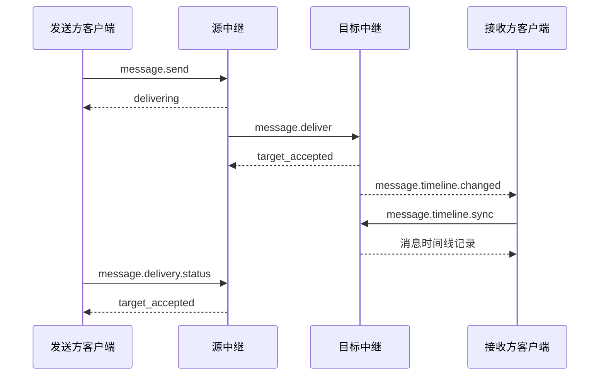

# 消息投递

[客户端—中继协议](../README.md) · [消息方法](../methods/messaging.md) · [跨中继投递方法](../../relay-rpc/methods/message-delivery.md#messagedeliver)

消息投递以账户为单位。发送客户端提交一个不可变的 `MessageEnvelope`，以及供发送账户和收件账户设备解密的密钥盒。源中继是接受 `message.send` 的发送账户归属中继，目标中继是负责收件账户的中继；两者可以是同一中继。

## 投递流程

### 跨账户投递

向其他账户发送消息时：

1. 客户端向源中继调用 `message.send`。源中继按该方法验证请求，接受后承担后续投递责任。请求提供 `sender_boxes` 时，将原信封及这些密钥盒追加到发送账户时间线；省略时发件记录不进入时间线。
2. 源中继根据收件账户的当前路由投递消息。收件账户也由本中继负责时，直接处理；否则调用目标中继的 `message.deliver`，携带原信封、`recipient_boxes`、发送设备证书和原授权材料。发送方密钥盒留在源中继。
3. 目标中继按[收件校验规则](#收件校验规则)验证收件条件。接受后，将原信封及 `recipient_boxes` 追加到收件账户时间线，供获准的设备同步。源中继确认目标接受后，投递状态为 `target_accepted`。

`message.send` 返回源中继当时已知的投递状态。尚未完成投递时返回 `delivering`，已经完成时返回终态；后续通过 `message.delivery.status` 查询。本地投递也可以在收件侧接受前返回 `delivering`。源中继的投递责任持续到终态或投递截止时间，不因中继重启而丢失；接受后的投递失败不删除发件记录。

发件记录的 `accepted_at` 为源中继的接受时间，收件记录的 `accepted_at` 为目标中继的接受时间。各记录的保留期及设备可见范围按接受时的规则确定，见[账户消息时间线](message-timeline.md#账户消息时间线)。

#### 投递示例

### 账户自身投递

账户自身投递时，`MessageEnvelope` 的发送账户和接收账户必须相同。客户端只向该账户的当前归属中继提交请求，中继不得为该投递发起或接受中继间 `message.deliver`。

中继按[收件校验规则](#收件校验规则)验证请求，并按[设备可见范围](message-timeline.md#设备可见范围)确定可同步的设备。成功时只向本账户时间线追加一条记录，保存原信封及完整的 `recipient_boxes`，直接返回 `target_accepted`。

### 收件校验规则

目标中继接受消息前必须确认：

1. 自己是收件账户当前有效路由指定的归属中继。
2. 原信封和收件方密钥盒符合[对象约束](../core-objects/messages-and-content.md#messageenvelope)，发送设备证书通过 [`DeviceCertificate`](../core-objects/accounts-and-devices.md#devicecertificate) 定义的签名及身份绑定验证，信封的设备签名有效，证书与信封的 `from`、`from_device_id` 一致。发送设备在提交请求时的权限由源中继通过设备会话确认。
3. 信封的 `created_at` 符合目标中继自身的时钟容错和消息递送期限。源中继与目标中继的策略相互独立。
4. 非自身投递具有有效的账户访问授权：由收件账户授予发送账户的 [`ContactGrant`](contacts.md#contactgrant)，或收件账户签发的 [`ContactInvite`](contacts.md#contactinvite)。省略凭据时，收件账户必须允许公开发现；无效凭据不得退回公开引导。授权只决定密文的投递权限，不证明其中的业务对象有效。
5. 收件方密钥盒中至少一台设备在收件账户的当前权威设备状态中有效。部分设备不可用不影响整条消息的接受；不可用设备不能读取记录。密钥盒不要求覆盖全部当前设备。

信封、签名或授权无效，或者全部收件设备不可用时，拒绝收件，不追加收件记录。结果保留期内已经接受的请求按[消息幂等重试](#消息幂等重试)处理。

## `DeliveryStatus`

`message.send`、`message.deliver` 和 `message.delivery.status` 的成功响应使用本对象，表达整条消息的投递状态。

| 字段 | 类型 | 必需 | 语义与约束 |
|---|---|---|---|
| `status` | string | 是 | 下表定义的投递状态 |
| `error` | [RelayError](../methods/conventions.md#relayerror) | 条件 | 投递失败原因；`status` 为 `failed` 时必须提供，其他状态必须省略 |
| `accepted_at` | integer | 是 | 中继接受消息的 Unix 秒；`message.send` 和 `message.delivery.status` 使用源中继的接受时间，`message.deliver` 使用目标中继的接受时间 |

### 状态取值与终态规则

| status | 含义 |
|---|---|
| `delivering` | 源中继已接受消息，投递尚未结束 |
| `target_accepted` | 成功终态：目标中继已接受消息，至少一台收件设备获准读取 |
| `failed` | 失败终态：源中继已结束投递，失败原因由 `error` 提供 |

`target_accepted` 表示目标中继接受消息，不表示接收客户端已经同步、解密或展示消息；设备权限随后变化或正文过期不改变这一状态。

源中继在重试、刷新路由或确认结果期间保持 `delivering`。进入 `target_accepted` 或 `failed` 后，终态和失败原因在结果保留期内不再变化，迟到的响应也不改变终态。`error` 使用[投递期限与重试](#投递期限与重试)确定的失败原因。

## 消息幂等重试

### 重复判定与重试规则

在同一网络、同一中继内，`message.send` 和 `message.deliver` 分别以 `(from, message_id)` 为逻辑消息键。HTTP、WebSocket 和中继 RPC 的传输关联 ID、连接和会话不参与逻辑消息键或请求内容的比较。

请求内容是否相同，以完整请求参数对象的 [Canonical JSON](../../general.md#canonical-json) 是否相同为准，包括签名、未知字段、数组顺序和可选字段的存在性。HTTP 使用请求体，WebSocket 和中继 RPC 使用 `params`。

请求仍须通过基本参数校验及相应方法的会话或中继连接认证，并满足该方法的调用要求。在结果保留期内：

- 同一键、相同内容的请求返回本中继已知的最新投递状态，`accepted_at` 保持不变。重复请求不得增加时间线记录、sequence、投递任务或时间线变化通知，也不得修改原记录的密钥盒和设备可见范围或重新开始已结束的投递。
- 同一键、不同内容的请求返回 `state_conflict`，不得覆盖原请求的内容或结果。
- 并发请求、响应丢失和中继重启均不改变上述要求。递送期限届满、业务授权失效或设备状态变化不追溯否定已经接受的事实；尚未被收件侧接受的消息仍须满足收件条件。

调用在接受前被明确拒绝时，不产生接受结果；调用方可以修正请求后再次提交，其中 `device_unknown` 须刷新设备并重新生成信封、密钥盒和消息 ID。

超时、断线或响应丢失不证明请求被拒绝；重试时必须向同一中继原样提交。

### 投递结果保留规则

每个中继的结果保留期至少持续到其 `accepted_at` 加接受时的 `message_retention`。在源中继的保留期内，`message.delivery.status` 必须能查询相应 `message.send` 的结果，包括自身投递。后续配置调整不得缩短已经承诺的保留期，重复请求不延长保留期。

结果保留期结束后，协议不再保证历史结果可查询或请求幂等。中继返回既有结果时仍须符合上述规则；无法识别原请求时按尚未接受的请求处理，超过当前消息递送期限的请求返回 `message_expired`。能够确定结果保留期已结束且结果不可取得时，也可以返回 `message_expired`。

## 投递期限与重试

### 投递截止时间

投递截止时间在源中继接受消息时确定，此后保持不变。其值取以下两者中较早者：

- 信封创建时间加源中继当时采用的消息递送期限；
- 源中继接受时间加当时的 `message_retention`。

### 错误处理与重试

源中继在截止时间内按下表处理投递错误，自动重试采用本地退避策略，不得立即循环请求。重试保持原信封、收件方密钥盒、发送设备证书和授权材料不变。

`rate_limited` 携带有效 `data.retry_after` 时，源中继还必须满足[限流重试等待规则](../methods/conventions.md#限流重试等待规则)规定的最短等待时间；省略提示时沿用本地退避策略。等待不改变已固化的投递截止时间；到达截止时间仍未完成时按下表结束投递，不得为了满足等待提示而延长投递责任或在截止时间后继续重试。

| 情况 | 处理 |
|---|---|
| `internal_error`、`bad_gateway`、`rate_limited`、`temporarily_unavailable` | 重试，状态保持 `delivering` |
| `route_stale`、`target_not_local`、`route_not_found`、`not_found`、`invalid_state` | 绕过缓存刷新路由后重试；切换目标须满足下节规定 |
| `device_unknown` | 以该错误结束投递；客户端刷新设备后，使用新信封、密钥盒和消息 ID 重新发送 |
| `clock_skew` | 以该错误结束投递；保留原信封和发件记录，不自动改写 `created_at`、重签或重新发送 |
| 其他已定义错误 | 以该错误结束投递 |
| 无法识别的远端错误码 | 结束投递，`error.code` 为 `bad_gateway` |
| 到达截止时间仍未完成 | 结束投递，`error.code` 为 `message_expired` |

### 投递结果确认与目标中继切换

超时、断线或响应丢失导致收件结果不明时，源中继在截止时间内向原目标确认；跨中继时原样重试 `message.deliver`。不得仅因原目标暂时不可达，就把结果不明的消息投向其他中继。

只有原目标明确拒绝本次收件并返回路由错误，或确定尚未尝试收件时，才可切换目标；新目标必须由更高 `revision` 的有效路由指定。

源中继的重试期限可能晚于目标结果保留期。结果过期后的拒绝和无法确认结果导致的超时失败，都不证明目标此前未接受消息；源中继和客户端不得仅据此自动换消息 ID 重发。

账户迁移对既有投递的影响见[归属中继变更](account-and-device-lifecycle.md#消息投递与结果查询)。
