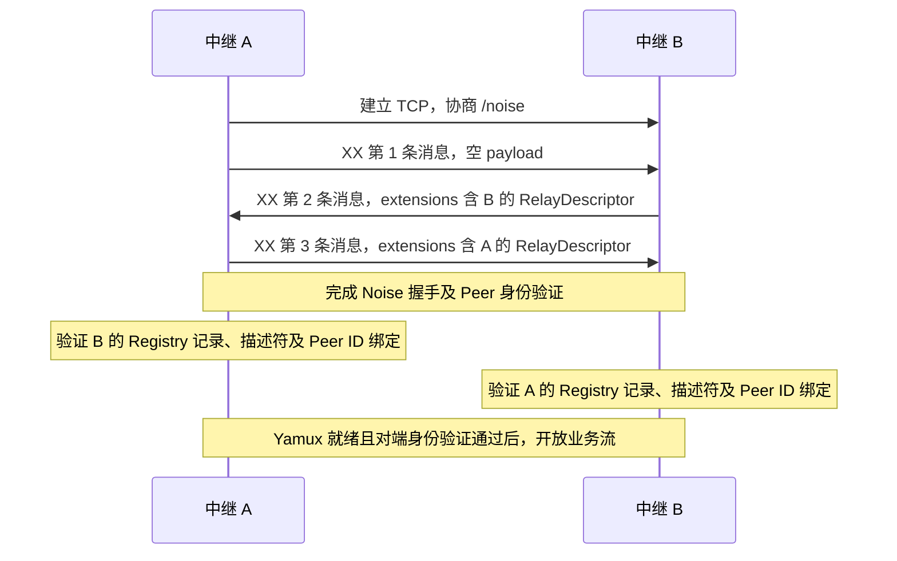

# 连接与身份认证

[中继 DHT 协议](../README.md) · [覆盖网络与节点维护](overlay-and-maintenance.md)

本章定义 DHT 覆盖网络的中继连接与身份认证。连接使用 TCP、Noise 和 Yamux；Noise 握手交换双方的完整 `RelayDescriptor`，每一方结合 Registry 当前记录和握手验证的 Peer ID，确认连接对端的中继身份。

## 候选发现

通过 Registry 发现目标中继、尚无可用 libp2p 地址时，中继按[中继发现](../../client-relay/concepts/discovery-and-sessions.md#中继发现)从 Registry 的 HTTPS 入口取得并验证 `RelayDescriptor`。已有有效且通过验证的描述符时，使用其中的 libp2p TCP 候选地址建立连接。

从本地保存的 Peer 信息或已验证 DHT Peer 得到的候选项可能只有 Peer ID 和 multiaddr。中继可以使用其中的 libp2p TCP 地址建立连接并执行本章的身份握手，握手得到的 Peer ID 必须与候选项及拨号地址声明的 Peer ID 相同。该连接在通过中继身份验证前不得承载业务流，也不得使候选项进入合格 Peer 集合或路由表。

候选连接和陌生中继入站连接均通过握手取得对端的完整 `RelayDescriptor`，再按下文验证，无需为本次连接认证另行通过 HTTPS 获取描述符。

## 中继连接与认证流程

以下 A 为 TCP 连接发起方，B 为响应方：

双方完成 Noise 握手并验证 `identity_sig` 后，分别按以下规则验证对端：

1. 从 `identity_key` 派生连接对端的 Peer ID；已知目标 Peer ID 时必须相同。解析握手中的 `extensions.relay_descriptor`；已知目标 `relay_id` 时，描述符的 `relay_id` 必须与其相同。
2. 在本地可信[网络上下文](../../general.md#网络上下文)中，取得描述符 `relay_id` 对应中继的当前 [Registry 记录](../../registry/core-objects.md#relayentry)。
3. 按[描述符验证规则](../../client-relay/core-objects/relay-descriptor.md#中继描述符验证规则)验证握手提供的描述符。
4. 确认描述符绑定的 Peer ID 与本次 Noise 握手验证的 Peer ID 相同。

中继在完成对端身份验证前不得通过该连接发送或处理业务请求和通知。任一身份验证失败时必须关闭连接，不得把该对端加入合格 Peer 集合或路由表。

后续成员资格、描述符有效期及 Peer ID 换绑按[覆盖网络维护规则](overlay-and-maintenance.md#dht-入网与路由表维护)处理。

## 安全协议与握手格式

安全连接协商使用标准 libp2p protocol ID `/noise`，Noise 协议名为 `Noise_XX_25519_ChaChaPoly_SHA256`。密钥生成、Peer 身份认证、握手处理和帧编码遵循 [libp2p Noise](https://github.com/libp2p/specs/blob/master/noise/README.md)；连接复用遵循 [libp2p Yamux](https://github.com/libp2p/specs/blob/master/yamux/README.md)。

### 握手载荷与描述符扩展

第二、三条 XX 握手消息的 payload 沿用标准 protobuf `NoiseHandshakePayload`，包含 `identity_key`（编号 1）、`identity_sig`（编号 2）和 `extensions`（编号 4）。中继必须在 `extensions` 中提供本章定义的 `relay_descriptor`，用于握手完成后的中继身份认证。

连接的响应方在第二条握手消息中发送自己的完整 payload，发起方在第三条握手消息中发送自己的完整 payload；二者均位于 Noise 加密的握手载荷中。

`NoiseExtensions` 中新增以下字段；其他字段遵循 libp2p 各扩展的定义：

| 字段 | 编号 | Protobuf 类型 | 必需 | 语义与约束 |
|---|---|---|---|---|
| `relay_descriptor` | 1025（实验） | bytes | 是 | 本端完整签名 [`RelayDescriptor`](../../client-relay/core-objects/relay-descriptor.md#relaydescriptor) 的 UTF-8 JSON 字节，包含 `relay_signature` 及签名覆盖的未知字段 |

本规范使用大于 1024 的实验扩展编号 1025，尚未取得正式分配。正式扩展编号须按 [libp2p Noise 扩展登记规则](https://github.com/libp2p/specs/blob/master/noise/README.md#noise-extensions)登记，并在本规范中更新。

### 解析与大小校验

握手 payload 按 [Protobuf 标准解析规则](https://protobuf.dev/programming-guides/encoding/#last-one-wins)解析：单值 bytes 字段采用最后一个值，单值嵌套消息合并。解析后的 `identity_key`、`identity_sig`、`extensions` 和 `extensions.relay_descriptor` 均必须存在；类型错误或编码非法时必须终止连接。身份签名、描述符和 Peer ID 绑定验证必须使用同一份解析结果。未知 protobuf 字段按兼容规则忽略。

描述符的 JSON 编解码和规范化遵循[协议总则](../../general.md#json-与字段表示)；其中的 `relay_id` 必须为[规范中继 ID](../../registry/core-objects.md#中继-id)。

单条 Noise 握手消息不得超过 65,535 bytes。该长度包含 Noise 公钥、完整 protobuf payload 和加密认证开销，不包含外层长度前缀；超过上限时必须终止连接。
